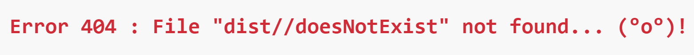
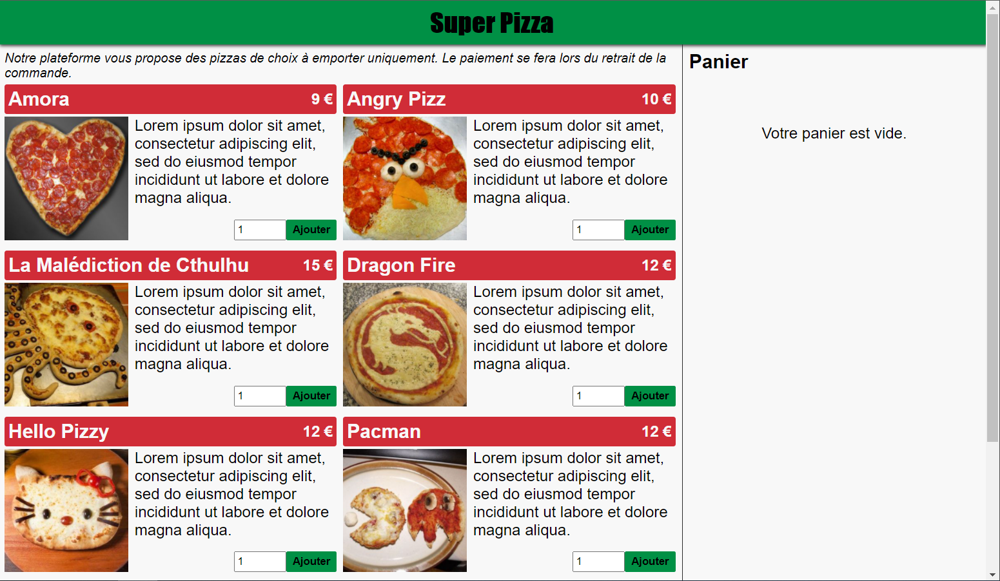
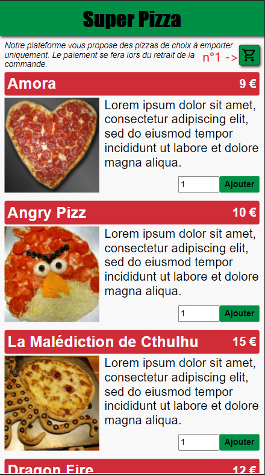
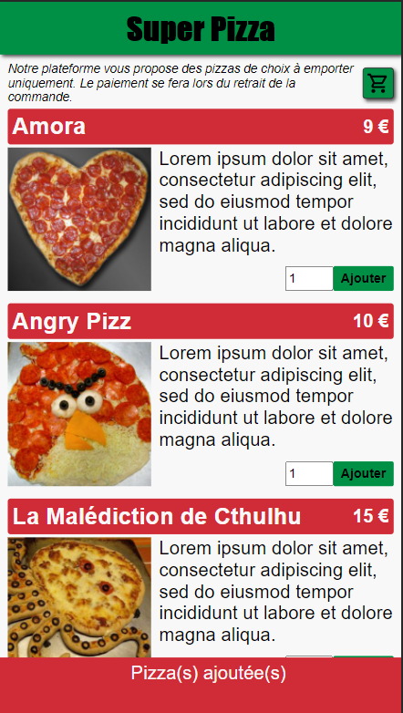
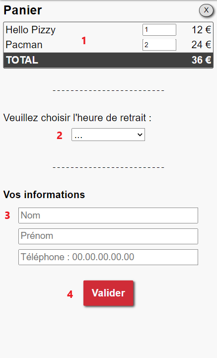
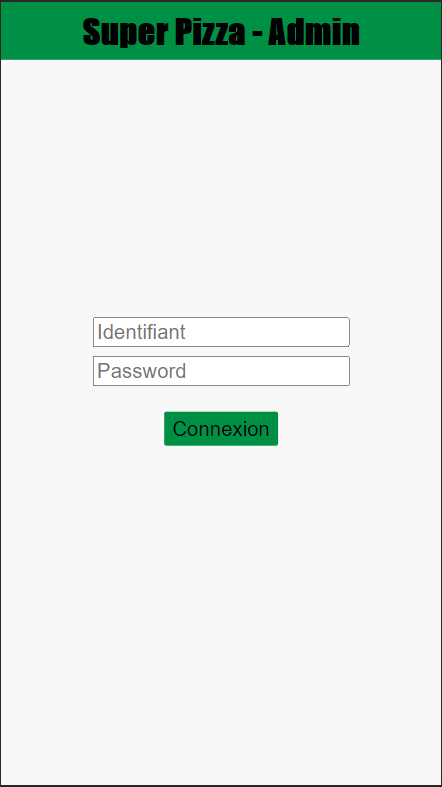
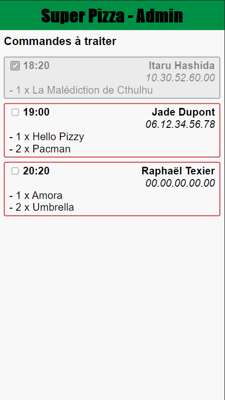

# SuperPizza

SuperPizza est une web app Javascript de pizzaria fictive. Elle permet de commander des pizzas à emporter pour de potentiels clients. Elle comporte également une interface d'administration, permettant aux pizzaïolos de visualiser l'ensemble des commandes à réaliser, en temps réel, et de les valider une fois les pizzas prêtes.

## Table des matières
1. [Informations générales](#informations-générales)
2. [Choix technologiques](#choix-technologiques)
3. [Installation](#installation)  
  3.1. [Pré-requis](#pré-requis)  
  3.2. [Base de données](#base-de-données)  
  3.3. [Application](#application)  
  3.4. [Lancement](#lancement)  
  3.5. [Tests](#tests)
4. [Utilisation](#utilisation)  
  4.1. [App consommateurs](#app-consommateurs)  
  4.2. [App pizzaïlo](#app-pizzaïolo)


## Informations générales

SuperPizza a été réalisé dans le cadre d'un test d'embauche sur 2 semaines. Elle a pour vocation de montrer ce dont je suis capable en un temps donné, dans des conditions normales de développement.
Elle a été testé avec 
- Chrome v87.0.4280.141 et Edge v88.0.705.50 sur PC
- Chrome Android v88.0.4324.93 et Safari iOs v14.3 sur smartphone


## Choix technologiques

- [VueJS - v2.6.12](https://vuejs.org/)
- [NodeJS - v14.15.4](https://nodejs.org/en/)
- [MariaDB - v10.1.47](https://mariadb.org/)

De manière globale, je préfère restreindre au minimum l'utilisation de bibliothèques tierces si je peux m'abstenir.
Comme convenu, je suis partie sur une base de FullStack Javascript, avec en back du NodeJS et en front du VueJS.
J'ai fais le choix de respecter le standard [StandardJS](https://standardjs.com/).

### VueJS

Je suis partie sur la base de 2 SPA responsives en SFC VueJS, une pour les consommateurs et l'autre pour les pizzaïolos. 
J'ai fais le choix de n'utiliser aucune librairie telle que VueRouteur ou VueX. 
J'utilise [Parcel](https://fr.parceljs.org/) afin d'empaqueter la partie cliente pour la publier depuis NodeJS.

### NodeJS

J'utilise les bibliothèques [mariaDb](https://www.npmjs.com/package/mariadb) pour la connexion à la base de données, et [ws](https://www.npmjs.com/package/ws) pour l'instanciation de mon serveur de webSocket.

### Base de données

J'utilise donc MariaDB, permettant l'utilisation d'évènements planifiés, étant openSource et facile d'utilisation.

### Test

Je n'utilise, là encore, aucun framework de test. J'ai donc développé un utilitaire pour tester la partie serveur.

## Installation

Cette installation est adaptée pour Linux.

### Pré-requis 
- Node v14
- MariaDb server

### Base de données
La base de données contient un évènement programmé, il est donc nécessaire d'activer l'event_scheduler.
De plus, le script d'initialisation de la base se trouve dans le répertoire git du projet. Il est donc nécessaire de **cloner le repo** avant d'effectuer la suite.

Démarrer au préalable mariaDB
```bash
sudo /etc/init.d/mysql start
```
Se connecter à mariaDB avec : 
```bash
sudo mysql
```
Puis activer l'event_scheduler (n'est actif que jusqu'au prochain redémarrage): 
```sql
SET GLOBAL event_scheduler = ON;
```
Pour modifier durablement ce paramètre, il est nécessaire de modifier le fichier mysqld.cnf : 
```bash
vi /etc/mysql/mysql.conf.d/mysqld.cnf
```
Ajouter la ligne suivante après le stanza "[mysql]":
```ini
[mysql]
event_scheduler = on
```
Enregistrer et quitter. Se placer à la racine du projet et lancer la commande suivante pour initialiser la base de données : 
```bash
sudo mysql < database/init.sql
```
Enfin, saisir les commandes suivantes, pour créer l'utilisateur : 
```sql
CREATE USER IF NOT EXISTS admin@localhost IDENTIFIED BY 'admin';
GRANT ALL ON superpizza.* TO admin@localhost;
FLUSH privileges;
```

### Application
Lancer la commande : 
```bash
npm install
```
Modifier le fichier server/assets/config.json selon votre configuration

```json
{
  "database": {
    "host": <Hostname de la base de données>,
    "user": <Utilisateur de la base de données>,
    "password": <Mot de passe de l'utilisateur>,
    "database": <Nom de la base de données>
  },
  "server": {
    "port": <Port d'écoute du serveur lorsque process.env.PORT n'est pas défini>,
    "distPath": <Chemin d'accès au répertoire du code buildé relatif a la racine du projet>
  }
}
```

Enfin lancer la commande :
```bash
npm run build
```
Le mot de passe de l'application Pizzaïolo nécessite d'être initialisé une première fois. Pour cela, saisir la commande suivante : 
```bash
npm run start -- --adminPassword <votrePassword>
```
### Lancement
Saisir la commande suivante : 
```bash
npm run start
```
Accéder à la partie consommateur via l'url ```http://<ip du serveur>:<port de la configuration>```
Accéder à la partie pizzaïolo via l'url ```http://<ip du serveur>:<port de la configuration>/admin```

### Tests
Afin de lancer les tests unitaires, il suffit de lancer
```bash
npm run test
```
Par défaut c'est le mode silent qui est activé. Pour avoir un rendu plus verbeux, il faudra soit modifier la commande dans package.json, soit lancer la commande node directement dans la console.

La sortie de la commande devrait ressembler à ceci 
```
[...]
************************************************************************
Execution des tests pour la classe : WebSocketServerTest
************************************************************************
=> Fonction constructorTest
OK OK OK OK 
=> Fonction registerDataBaseTest
OK 
=> Fonction updateTimeManagerTest
OK OK 
=> Fonction initTest
OK 
=> Fonction routeTest
OK OK OK OK OK OK OK OK 
************************************************************************
************************************************************************
Total test passés : 79
Test OK : 79
Test KO : 0
```

## Utilisation
Superpizza dispose de deux interfaces disponibles aux adresses suivantes: 
- Consommateurs : ```http://<ip du serveur>:<port de la configuration>```
- Pizzaïolo : ```http://<ip du serveur>:<port de la configuration>/admin```

Lorsque l'adresse saisie n'est pas correcte, le message suivant s'affiche : 



### App consommateurs

Après avoir saisi l'url dans le navigateur, on obtiens l'interface suivante : 




On visualise ainsi le menu des pizzas, et le panier (pour la version pc). Ce dernier étant disponible sur smartphone via le bouton du caddie (n°1)
Pour chaque pizza, on pourra visualiser une photo, une description, un prix unitaire, et un champs d'ajout.

Pour ajouter des pizzas, il faut saisir la quantité de pizzas désirée dans les champs de texte puis appuyer sur le bouton "Ajouter".

**Important** : *La quantité doit être comprise entre 0 et 31*



Un message s'affiche alors en bas de l'écran. Sur la version PC, vous pourrez visualiser l'ajout de la pizza à votre panier directement.

Une fois que vous avez sélectionnez les pizzas de votre choix, votre panier devrais ressembler à ceci : 



1. **Récapitulatif du panier**

On retrouve l'ensemble des pizzas commandées, leur quantité (modifiable) et le total de chaque ligne.
Egalement le total de l'ensemble de la commande.

2. **Heure de retrait**

Ce champ permet de sélectionner l'heure de retrait désirée, parmis ceux disponibles. **Attention** : si pour la quantité de pizzas demandée, il n'y aucun créneaux de retrait possible, l'interface affichera le message suivant en rouge : 

    Veuillez nous excuser, il semble qu'il n'y ai pas de créneau possible pour votre commande. Veuillez tenter avec moins de pizzas, ou demain ヽ(*⌒▽⌒*)ﾉ

3. **Informations**

Il s'agit de trois champs de formulaire :
- Nom : entre 3 et 30 caractères
- Prénom : entre 3 et 30 caractères
- Téléphone : devant respecter le format 00.00.00.00.00

4. **Validation**

Tous les champs du Panier (quantités de pizzas, heure de retrait et infos personnelles) sont requis. 
S'ils ne sont pas complétés ou ne respectent pas les exigences établies, des messages d'erreurs s'afficheront et il ne sera pas possible d'envoyer votre commande.
Sinon elle sera envoyée directement aux Pizzaïolos, votre Panier se videra et le message suivant apparaîtra :

    Merci pour votre commande, elle a été transmise à nos Pizzaïolos de compétition ! Vous pourrez venir la récupérer à partir de <Heure de retrait séléctionnée>.

### App pizzaïlo

Les interfaces pour PC et Smartphone sont sensiblement identiques. Les impressions d'écrans suivantes se focaliseront donc sur la version smartphone.
Après avoir saisi l'url dans le navigateur, la première fois, il est nécessaire de s'identifier. 



Si les informations demandées ne sont pas correcte, le message suivant s'affichera : 

    Erreur lors de l'authentification. Merci de saisir à nouveau vos identifiants.

Une fois authentifié, l'interface suivante s'affiche : 



On visualise ainsi les commandes à traiter dans l'ordre chronologique. La case à cocher permet de spécifier si la commande a été traitée par les pizzaïolos.

*Informations* : Une tâche planifiée se lance tous les jours à minuit et vide les commandes passées la veille.
